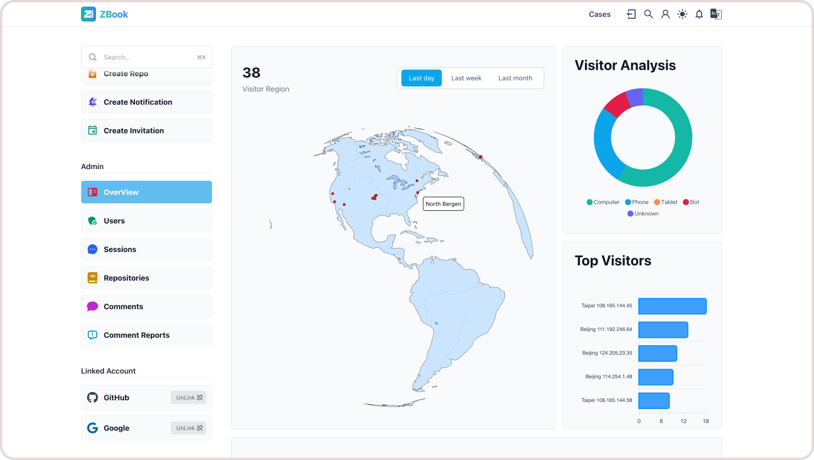
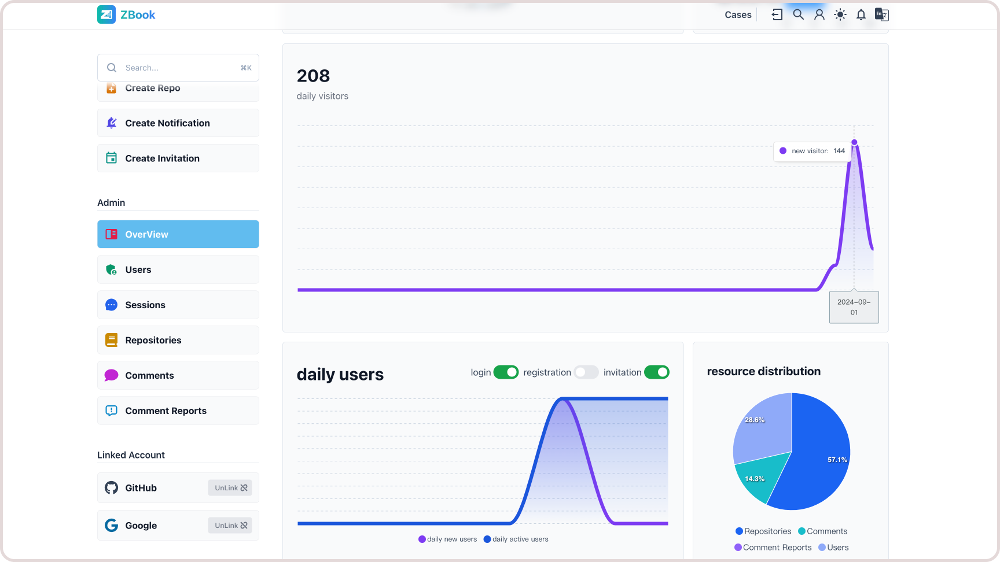

# Monitoring

Monitor information on visitors, users, sessions, repositories, comments, and more.

## Overview

ZBook collects and gathers detailed information on visitors, such as `IP address`, `access time`, `UserAgent`, etc. The collected data is stored in `Redis` and processed by the backend. Administrators can log into ZBook to view this data on the dashboard, displaying and analyzing visitor sources, device types, and active visitors through visualizations. Access records are further processed, such as retrieving geographical location information based on IP addresses and displaying it on a geographical distribution map.

Administrators can use this data to understand visitor behavior, optimize website performance, and develop more effective operational strategies. The entire process ensures data timeliness and accuracy while focusing on user privacy protection. Only accounts with administrator privileges can access these detailed visitor analysis data.

```mermaid
graph LR
    A[User visits website] --> B[Webpage collects userAgent information]
    B --Store to --> C[Redis]
    F[Display page] --> |Request| D[Backend]
    D --> |Request| C[Redis]
    C --> |Return userAgent information| D
    D --> |Request| E[(Geographical Database)]
    E --> |Return geographical information| D
    D --> |Return data| F
```

### Visitor Information Overview

The following screenshot provides an overview of ZBook’s visitor analysis, offering detailed monitoring and analysis of website visitors. The page includes the following key components:

- **Visitor Origin**: Displays the geographical location of website visitors, visually representing their global distribution on a map. Each visitor's specific location is marked on the map, allowing administrators to see the origin city and country of visitors clearly.
- **Access Analysis**: Shows the proportion of different types of devices used for access via pie charts, including computers, phones, tablets, bots, and unknown devices. This chart helps administrators understand the types of devices visitors use, allowing for optimization of website performance across devices.
- **Active Visitors**: Uses a bar chart to display the most frequent IP addresses. Each entry shows the visitor's city and IP address, enabling administrators to quickly identify the most active visitor groups.
- **Total Visitors and Daily Visitors**: Displays the total number of visitors and daily visitor numbers, helping administrators track changes in website traffic trends and identify peak traffic periods.

These features allow administrators to analyze visitor behavior in-depth, optimize website content and user experience, and develop more targeted operational strategies.

### Other Overviews

The following screenshot provides an overview of ZBook, including:

- **Visitor Count**: Displays the number of visitors each day over the past month, visually represented through a line (or curve) chart.
- **Access Analysis**: Shows the proportion of different types of devices used for access via pie charts, similar to the visitor information overview.
- **Daily Users**: Uses a line chart to show the number of new and logged-in users over the past week. Additionally, there are buttons for `Login`, `Register`, and `Invite`. If the login button is turned off, only administrator accounts can log in. If the registration button is turned off, new users cannot register. If the invite button is enabled, invited users can still register even if registration is closed.
- **Resource Distribution**: Displays current information on the number of users, repositories, comments, etc., helping administrators track changes in website usage information.

These features allow administrators to analyze user behavior deeply, optimize website content and user experience, and develop more targeted operational strategies.

## Summary

In addition to the above visitor information, summaries of users, sessions, repositories, comments, and reports are also available for review. For example, on the user page, administrator accounts can view and filter users, and block or delete non-administrator users.

