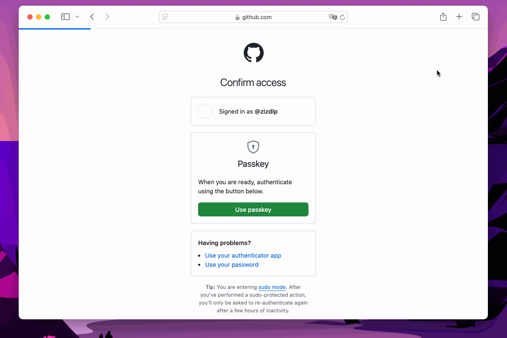

# Configuration

This document provides detailed information on various configuration parameters for the ZBook system. These configuration parameters determine how the system operates, including the document repository, authentication methods, email settings, database connections, and storage configurations.

## System Parameter Configuration

System parameter configuration primarily involves basic application settings, WebSocket and backend service URLs, authentication service configurations, etc.

### Basic Configuration

Here are the basic configuration parameters:

- **DOC_REPONAME**: Sets the target repository name for the "Documents" button on the homepage. When clicked, it will redirect to the specified GitHub repository to view the document contents.
- **DOC_USERNAME**: Sets the GitHub username for the "Documents" button on the homepage. Used in conjunction with `DOC_REPONAME` to determine the full URL of the document link.
- **BEIAN**: The website’s record number. If set, it will be displayed at the bottom of the homepage to comply with legal requirements in mainland China.

```bash
DOC_REPONAME=docs  # Repository name for the "Documents" button on the homepage
DOC_USERNAME=admin # GitHub username for the "Documents" button on the homepage
BEIAN=""           # Record number, if not empty, will be displayed in the website's footer
```


The following parameters configure system port information. If using a server, replace `localhost:ip` in the examples with the corresponding domain name:

- **WEBSOCKET_URL**: Sets the URL for the WebSocket service, allowing the frontend to communicate in real-time with the WebSocket server.
- **BACKEND_URL**: Sets the URL for the backend service, which the frontend will use to access backend APIs.
- **AUTH_URL**: Sets the URL for the authentication service, used for user authentication.
- **AUTH_SECRET**: A key for encrypting and validating authentication tokens, should be set to a secure random string.
- **AUTH_TRUST_HOST**: Determines whether to trust the current hostname, used to prevent Cross-Site Request Forgery (CSRF) attacks during authentication. Set to `true` to trust the current host.

```bash
WEBSOCKET_URL=ws://localhost:9099
BACKEND_URL=http://localhost:8080
AUTH_URL=http://localhost:3000
AUTH_SECRET=abcdefghigklmnopgrstuvwxyz
AUTH_TRUST_HOST=true
```

### Authentication Configuration

#### GitHub OAuth

GitHub OAuth configuration allows users to log in using their GitHub accounts. Configuration parameters include GitHub OAuth client ID and client secret.

```bash
GITHUB_ID=fake-github-id
GITHUB_SECRET=fake-github-secret
```

Log in to github.com, select `Settings`, then scroll down and select `Developer settings`, and click `New OAuth App`. Configure various parameters as shown in the image. If on a server, replace `localhost:port` with your domain name.


#### Google OAuth

Google OAuth configuration allows users to log in using their Google accounts. Configuration parameters include Google OAuth client ID and client secret. For specific configuration instructions, refer to [this guide](https://medium.com/@tony.infisical/guide-to-using-oauth-2-0-to-access-google-apis-dead94d6866d).

### Email Configuration

Email configuration is used for sending notifications or verification emails from the system. Configuration parameters include the sender's name, email address, SMTP server address, and authentication information. For specific configuration instructions, refer to [this guide](https://mailtrap.io/blog/gmail-smtp/).

```bash
EMAIL_SENDER_NAME=zbook
EMAIL_SENDER_ADDRESS=example@example.com ## Email address
EMAIL_SENDER_PASSWORD=email-secret ## Password
SMTP_AUTH_ADDR=smtp.qq.com # Email server
SMTP_SERVER_ADDR=smtp.qq.com:25 # Email server
```

### Database Configuration

Database configuration involves connection information for the PostgreSQL database, such as database name, username, password, etc. Ensure this information is configured correctly so that the application can connect to the database properly.

```bash
POSTGRES_USER=root
POSTGRES_PASSWORD=postgres-secret
POSTGRES_DB=zbook
```

### Storage Configuration

Storage configuration is used to set up access information for MinIO or other storage services. Configuration parameters include the storage service username, password, and bucket settings.

```bash
MINIO_ROOT_USER=root
MINIO_ROOT_PASSWORD=minio-secret
```

## Repository Parameter Configuration

Repository parameter configuration is primarily used to set information related to the document repository. These parameters determine how the system interacts with document repositories on GitHub or other code hosting platforms.

| **Attribute**              | **Description**                                                                                                                                                                            |
| -------------------------- | ------------------------------------------------------------------------------------------------------------------------------------------------------------------------------------------ |
| **Repository Name**        | Customizable, supports characters in Chinese, English, etc.; cannot include characters with special URL meanings (e.g., `?`, `&`, `.`); repository names for the same user must be unique. |
| **Visibility**             | Supports multiple levels of visibility: `Public` (no permissions required), `Logged-in` (visible to logged-in users), `Selected Users` (visible only to selected user groups).             |
| **Sidebar Style**          | Sets the sidebar style for repository display.                                                                                                                                             |
| **Content Style**          | Sets the content style for repository display.                                                                                                                                             |
| **Git URL**                | Repository's Git address, only supports HTTP (SSH is not supported).                                                                                                                       |
| **Repository Description** | A description of the repository to help visitors understand its contents and facilitate search.                                                                                            |
| **GitHub Sync Token**      | For GitHub repositories, you can use GitHub Actions for automatic synchronization.                                                                                                         |
| **Token or Password**      | For private repositories, provide permissions for ZBook to read.                                                                                                                           |


### GitHub Fine-Grained Tokens

For private repositories requiring repository permissions, it is recommended not to use passwords. Instead, use fine-grained tokens for GitHub repositories, granting read-only access to specific repositories. GitHub provides tokens for authentication and authorization, allowing fine-grained permission control. Here are the steps and examples for using GitHub tokens for limited permission assignments:

- Go to GitHub, click on your avatar in the upper right corner, and select **Settings**.
- In the left navigation bar, select **Developer settings**, then **Personal access tokens**.
- Click **Generate new token**.
- Provide a description, select the required permissions (e.g., read/write access to repositories, manage releases, etc.).
  - Grant permissions to specific repositories
  - Provide read-only access, such as shown in the image, granting only `Contents` read access.
- Click **Generate token** and copy the generated token. **Note:** The token will only be shown once after generation, so make sure to save it.


