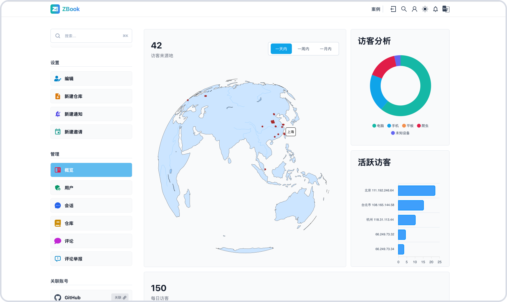

# 监控

监控访客、用户、会话、仓库、评论等信息。

## 访客

ZBook 会对访客信息进行采集和收集，比如 IP 地址、访问时间、UserAgent 等详细信息。采集到的数据将被存储在 Redis 中，并由后端进行汇总处理。管理员可以通过登录 ZBook，在仪表盘页面查看这些数据，通过可视化的方式展示和分析访客来源、设备类型、活跃访客等信息。访问记录将被进一步处理，如根据 IP 地址获取访客的地理位置信息，并在地理分布图上展示。管理员可以使用这些数据来了解访客行为、优化网站性能，以及制定更有效的运营策略。整个过程确保数据的实时性和准确性，同时注重用户隐私的保护，只有具有管理员权限的账号才可以访问这些详细的访客分析数据。

```mermaid
graph LR
    A[用户访问网站] --> B[网页采集 userAgent 信息]
    B --存储到 --> C[Redis]
    F[展示页面] --> |请求| D[后端]
    D --> |请求| C[Redis]
    C--> |返回 userAgent 信息| D
    D --> |请求| E[(地理数据库)]
    E --> |返回地理信息| D
    D --> |返回数据| F
```

2. **左侧菜单栏**：

   - 包含多个导航选项，例如：
     - **编辑**：用于修改内容或设置。
     - **新建仓库**、**新建通知**、**新建邀请**：用于添加新项目或管理团队合作。
     - **管理**部分包括：概览、用户、会话、仓库、评论、评论举报等。
     - **关联账号**部分显示了与 GitHub 的关联状态。

3. **访客来源地图**：

   - 中间展示了一个访客来源地图，标注了访客的地理位置。地图上可以看到多个红点，表示访客的具体位置，当前显示了 42 个访客来源地。

4. **访客分析**：

   - 右侧上方是访客分析图，使用饼状图展示了访客的设备类型分布，包括电脑、手机、平板、爬虫和未知设备。

5. **活跃访客**：

   - 右侧下方列出了当前最活跃的访客列表，显示了他们的 IP 地址和访问次数。数据显示了五个活跃访客，分别来自北京、台北、杭州等地。

6. **时间选择**：

   - 在访客来源地图的右上方，有一个时间范围选择器，用户可以选择查看一天内、一周内或一月内的访客数据。

7. **每日访客**：
   - 左下角显示了一个“每日访客”数据，当前展示的是 150 名每日访客。

这个仪表板可以帮助用户实时监控访客的来源、设备类型以及活跃度，提供直观的数据分析，以便做出相应的优化和决策。

